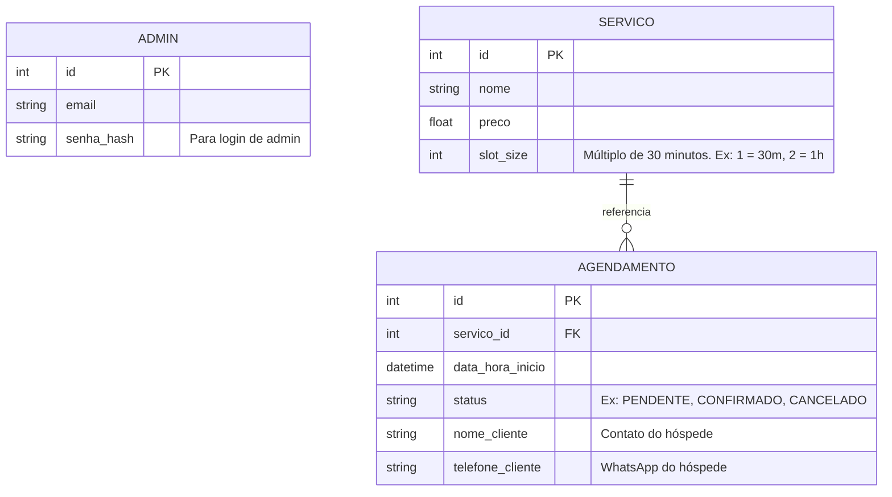

# Design: Sistema de Barbearia (MVP 60h)

## Context

O MVP do Sistema de Barbearia exige uma implementação muito ágil devido à restrição de 60 horas. Precisamos de uma arquitetura que ofereça segurança de tipos ponta a ponta e interfaces de usuário responsivas, mas com a menor complexidade de infraestrutura possível. Por isso, a escolha de Next.js (com Server Components e server actions quando útil) integrado com FastAPI via REST. O banco SQLite foi escolhido pela ausência de configuração de servidor, ideal para o MVP, e o SQLAlchemy fornece um ORM robusto para futuras migrações (ex: PostgreSQL).

## Goals / Non-goals

**Objetivos:**
- Criar a API REST com FastAPI e validação forte (Pydantic).
- Implementar o banco de dados com SQLite + SQLAlchemy, com estrutura simplificada de "Slots".
- Criar a interface do cliente "guest-only" (sem login) no Next.js.
- Criar a interface de Dashboard do Admin (com login).
- Disparar automaticamente uma mensagem de WhatsApp de confirmação ao cliente via **Twilio API** após o agendamento ser salvo no banco.

**Não-Objetivos (Fora do Escopo):**
- Integração oficial direta com a API do WhatsApp/Meta (o Twilio abstrai isso).
- Pagamentos online ou integração de gateway.
- Sistema de login/senha para clientes finais.
- Lógica complexa de tempo (ex: serviços de 15min e 45min intercalados quebrando slots). Vamos fixar a "moeda de tempo" em blocos de 30 minutos.

## Proposed Design

### Arquitetura de Componentes
1. **Frontend (Next.js)**
   - App Router (`/app`)
   - Rotas Públicas: `/` (Vitrine), `/agendar` (Fluxo de marcação)
   - Rotas Privadas (Admin): `/admin/login`, `/admin/dashboard`
   - Data Fetching: Fetch API nativo do Next.js comunicando com o FastAPI.
   - UI: TailwindCSS + Shadcn/UI. Formulários com React Hook Form + Zod.

2. **Backend (FastAPI)**
   - API modular usando APIRouter.
   - Rotas principais: `/api/servicos`, `/api/agendamentos`.
   - Autenticação Simples: JWT apenas para o fluxo de Admin (rotas `/api/admin/*`).
   - Validação de entrada/saída com Pydantic schemas.
   - **Twilio SDK** (`pip install twilio`): Disparado internamente após `POST /api/agendamentos` para enviar mensagem de confirmação ao WhatsApp do cliente. Falhas no Twilio são logadas mas não desfazem o agendamento.

### Modelo de Dados (SQLite)

### Regras de Negócio de Tempo
- O calendário só renderiza horários em intervalos de 30 minutos (ex: 09:00, 09:30, 10:00).
- Quando o usuário solicita os horários disponíveis (`GET /api/agendamentos/disponiveis`), o FastAPI:
  1. Verifica a configuração de horário de trabalho (ex: 09h às 18h).
  2. Subtrai os slots (`data_hora_inicio` + `slot_size` do Serviço) que já existem na tabela `Agendamento` naquela data.
  3. Retorna apenas os slots viáveis para o tamanho do serviço solicitado.

## Risks / Trade-offs

- ~~**Fricção do WhatsApp**: Confiar que o cliente vai apertar "Enviar" após deep link.~~ **Mitigado**: O Twilio envia a mensagem automaticamente do lado do servidor, eliminando a dependência de ação do cliente.
- **Concorrência**: O SQLite lida bem com a concorrência baixa esperada de uma barbearia local, mas em uso massivo simultâneo poderia bloquear a escrita (database lock). Considerado risco baixo para o contexto universitário.
- **Segurança de Slots**: Usaremos transações no SQLAlchemy para garantir que dois usuários não aloquem o mesmo slot no mesmo exato segundo.
